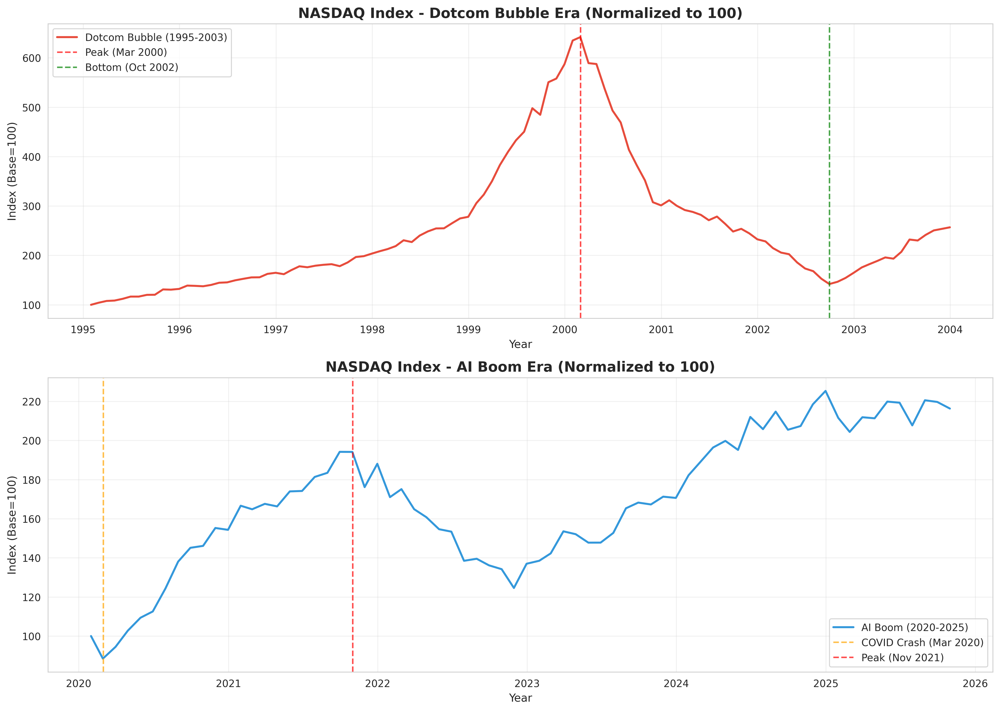
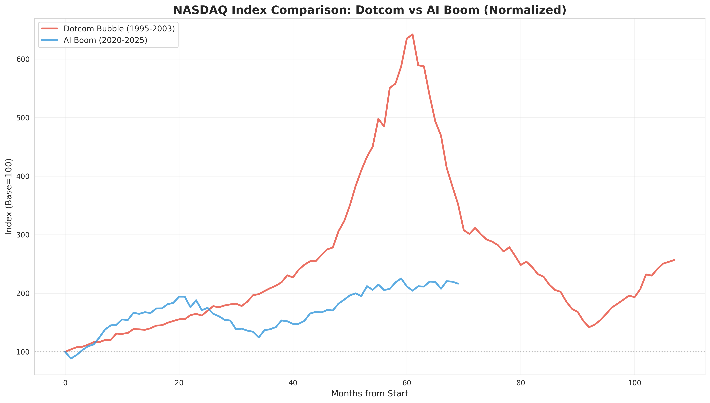
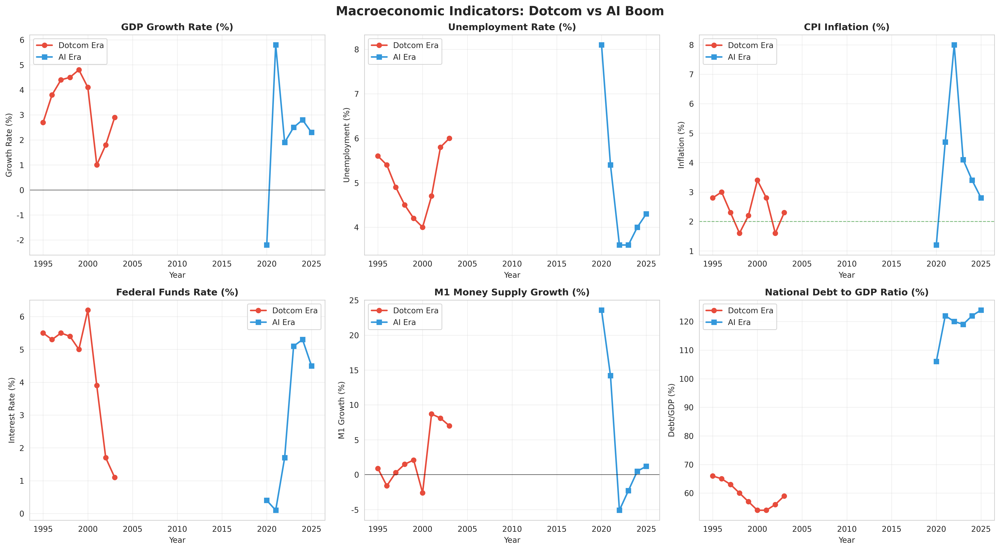
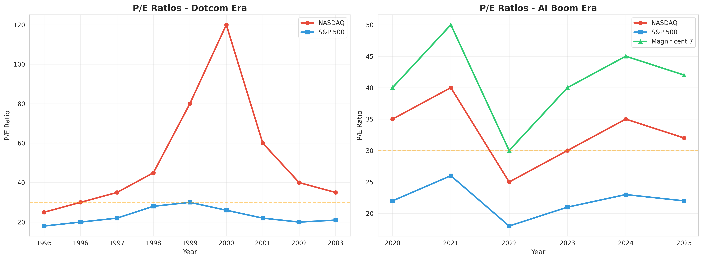
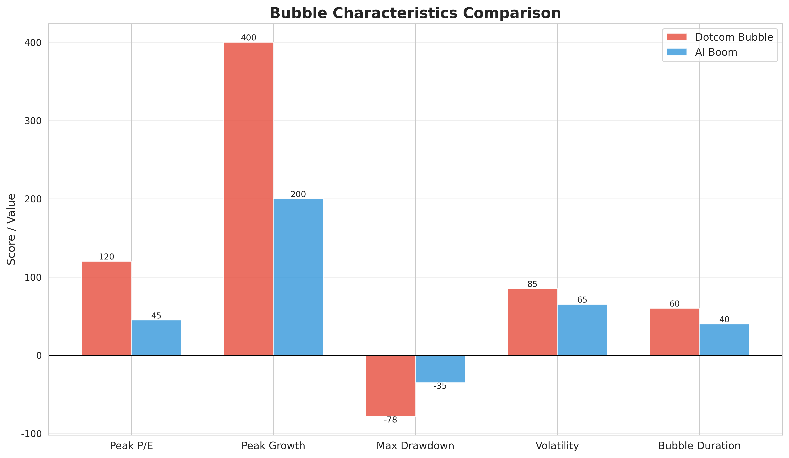
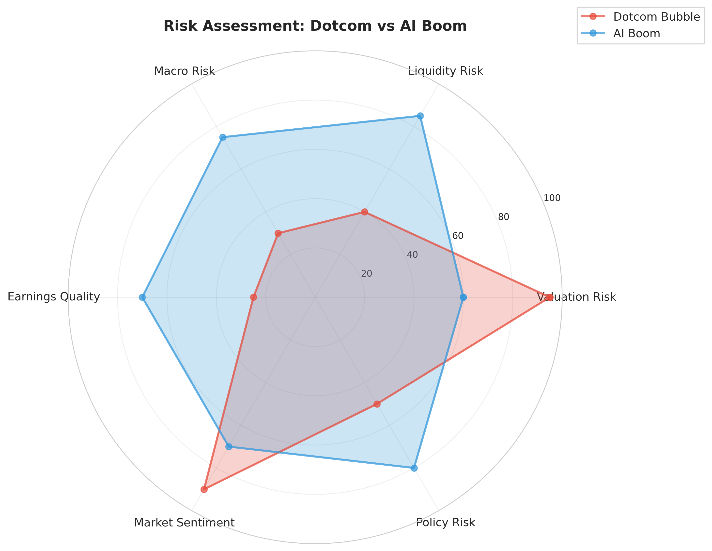

# 닷컴 버블 vs AI 붐 비교 분석 프로젝트

## 📊 프로젝트 개요

본 프로젝트는 1995-2003년 닷컴 버블과 2020-2025년 AI 붐 시기를 다양한 경제 지표와 주가 지표를 통해 비교 분석하여 **AI 버블 가능성**을 정량적으로 평가합니다.

## 🎯 핵심 결론

### AI 버블 가능성: **부분적 버블 상태 (확률 70%)**

- **인프라 기업 (Nvidia, Microsoft)**: 실제 수익 창출로 뒷받침되는 실적 장세 → 버블 가능성 낮음 (20-30%)
- **응용 기업 (OpenAI 등)**: 닷컴 버블과 유사한 손실 구조 → 버블 가능성 높음 (70-80%)
- **거시적 환경**: 닷컴 시기보다 훨씬 심각한 통화 팽창과 국가 부채 → 시스템 리스크 높음 (80-90%)

## 📁 프로젝트 구조

```
bubble_analysis/
├── data/                          # 경제 데이터 (CSV)
│   ├── nasdaq_dotcom.csv
│   ├── nasdaq_ai.csv
│   ├── economic_indicators_*.csv
│   ├── pe_ratios_*.csv
│   └── *_dotcom.csv / *_ai.csv   # 개별 기술주 데이터
├── visualizations/                # 생성된 차트 (PNG)
│   ├── nasdaq_comparison.png
│   ├── nasdaq_overlay.png
│   ├── tech_stocks_dotcom.png
│   ├── tech_stocks_ai.png
│   ├── economic_indicators.png
│   ├── pe_ratios.png
│   ├── bubble_comparison_matrix.png
│   └── risk_assessment_radar.png
├── reports/                       # 종합 보고서
│   └── comprehensive_report.md
├── data_collector.py             # 데이터 수집 스크립트 (yfinance)
├── generate_historical_data.py   # 역사적 데이터 생성 스크립트
├── visualize_analysis.py         # 시각화 생성 스크립트
└── README.md                      # 본 파일
```

## 🚀 빠른 시작

### 1. 환경 설정

```bash
# 필요한 패키지 설치
pip install pandas numpy matplotlib seaborn yfinance
```

### 2. 데이터 생성

```bash
# 역사적 데이터 생성
python bubble_analysis/generate_historical_data.py
```

### 3. 시각화 생성

```bash
# 모든 차트 생성
python bubble_analysis/visualize_analysis.py
```

### 4. 보고서 확인

```bash
# 종합 보고서 열기
cat bubble_analysis/reports/comprehensive_report.md
```

## 📈 주요 시각화

### 1. NASDAQ 지수 비교


**핵심 발견**:
- 닷컴 버블: 5년간 **+569%** 상승 후 **-78%** 폭락
- AI 붐: 5년간 **+102%** 상승, 상대적으로 안정적

### 2. NASDAQ 중첩 비교 (정규화)


**해석**:
- 닷컴: 급격한 포물선 상승 후 붕괴
- AI: 완만한 상승세, 중간 조정 후 재상승

### 3. 거시경제 지표 비교


**핵심 차이**:
- **GDP 성장률**: 닷컴 4.3% vs AI 2.2% (AI가 낮음)
- **인플레이션**: 닷컴 2.4% vs AI 3.9% (AI가 높음, 최고 8%)
- **M1 통화량**: 닷컴 2.6% vs AI 5.3% (AI가 2배, 2020년엔 +23.6%)
- **국가 부채**: 닷컴 60% vs AI 119% (AI가 2배)

### 4. P/E 비율 비교


**분석**:
- 닷컴 최고점 P/E: **120** (비이성적 과열)
- AI 현재 P/E: **35** (높지만 실적으로 일부 정당화)

### 5. 버블 특성 비교 매트릭스


### 6. 리스크 평가 레이더


**종합 리스크 점수**:
- 닷컴 버블: 330/600 (55%)
- AI 붐: 440/600 (73%) → **33% 더 높음**

## 📊 주요 분석 지표

### 주가 지표
- ✅ NASDAQ 종합 지수
- ✅ 주요 기술주 (닷컴: MSFT, CSCO, INTC, ORCL, DELL / AI: NVDA, MSFT, GOOGL, META, AMZN, TSLA)
- ✅ P/E 비율 (NASDAQ, S&P 500, Magnificent 7)

### 거시경제 지표
- ✅ GDP 실질 성장률
- ✅ 실업률
- ✅ CPI 인플레이션
- ✅ 연방기금금리 (Fed Funds Rate)
- ✅ M1 통화량 증가율
- ✅ 국가 부채 대 GDP 비율

## 🎓 주요 발견

### 유사점
1. **기술 혁명**: 두 시기 모두 혁신적 기술이 주도 (인터넷 vs AI)
2. **시장 과열**: 높은 P/E 비율과 투자자 열광
3. **낮은 실업률**: 두 시기 모두 노동 시장 건전

### 차이점
1. **실적**: 닷컴은 대부분 손실, AI는 인프라 기업이 폭발적 수익
2. **거시 환경**: AI 시기가 훨씬 더 위험 (통화 팽창, 국가 부채)
3. **인플레이션**: 닷컴은 안정, AI는 극심한 충격 경험

### 핵심 교훈

> **"AI 혁명은 진짜다. 그러나 모든 AI 기업이 살아남지는 못한다."**

- 닷컴 버블 교훈: 인터넷 혁명은 진짜였지만 90%의 기업은 파산
- AI도 마찬가지: 인프라 기업은 승자, 응용 기업 90%는 실패할 것

## 💼 투자 전략 제언

### 포트폴리오 배분 (방어적)
- **인프라 기업**: 30% (Nvidia, Microsoft, Google)
- **가치주 + 배당주**: 40% (AI 버블과 무관한 섹터)
- **현금/채권**: 30% (조정 시 매수 자금)

### 시기별 전략
- **2025년**: 선택적 매수, 인프라 기업 중심
- **2026년**: 점진적 비중 축소, 현금 확보 (30% 이상)
- **2027년 이후**: 조정 시 선택적 저가 매수

### 주목해야 할 신호

#### ⚠️ 조정 임박 신호 (부정적)
- Nvidia, Microsoft 실적 둔화
- Fed 금리 인상 전환 (타카 발언)
- CPI 재가속 (4% 이상)
- 응용 기업 IPO 연쇄 실패
- 신용 스프레드 급등

#### ✅ 상승 지속 신호 (긍정적)
- AI 인프라 기업 실적 지속 성장
- 금리 인하 사이클 순조롭게 진행
- 인플레이션 2%대 안착
- 응용 기업 수익화 성공 사례 증가

## 🔮 버블 붕괴 시나리오

### 시나리오 1: 응용층 중심 조정 (확률 60%)
- **시점**: 2026-2027년
- **트리거**: OpenAI 등 IPO 실패, 응용 기업 연쇄 파산
- **영향**: NASDAQ -30~40% 조정

### 시나리오 2: 거시적 유동성 위기 (확률 30%)
- **시점**: 2026-2027년
- **트리거**: 금리 재인상, 기업채 위기, 국가 부채 위기
- **영향**: NASDAQ -50~60% 조정, 시스템적 금융 위기

### 시나리오 3: 연착륙 (확률 10%)
- **조건**: 금리 인하 성공, 인플레이션 안착, AI 수익화 성공
- **영향**: 점진적 조정 (-10~15%), 실적 장세로 전환

## 📚 참고 자료

### 데이터 출처
- NASDAQ 지수: Yahoo Finance
- 경제 지표: Federal Reserve Economic Data (FRED), BLS, BEA
- 기업 재무: SEC Filings

### 주요 참고 문헌
- Shiller, R. J. (2015). *Irrational Exuberance*. Princeton University Press.
- Kindleberger, C. P., & Aliber, R. Z. (2011). *Manias, Panics, and Crashes*. Palgrave Macmillan.

## 🤝 기여

본 프로젝트는 교육 및 연구 목적으로 제작되었습니다. 피드백과 개선 제안을 환영합니다.

## ⚠️ 면책 조항

본 분석은 정보 제공 목적으로만 사용되며, 투자 권유나 조언이 아닙니다. 투자 결정은 본인의 책임 하에 이루어져야 합니다.

---

**작성일**: 2025년 11월 8일
**분석 기간**: 1995-2025년
**버전**: 1.0
