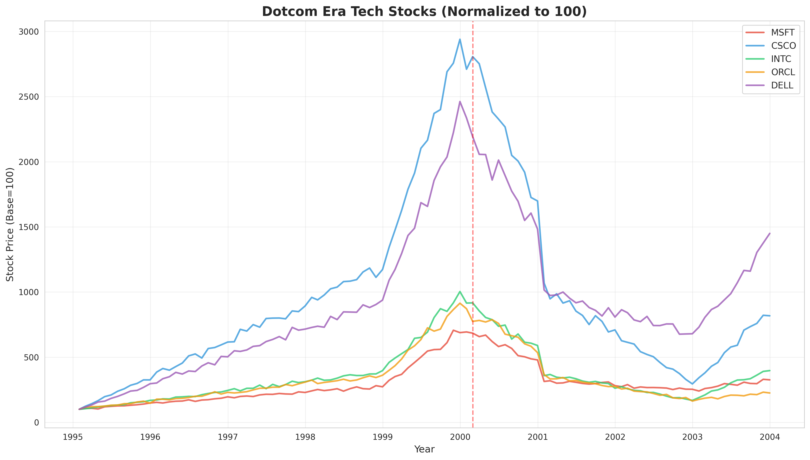
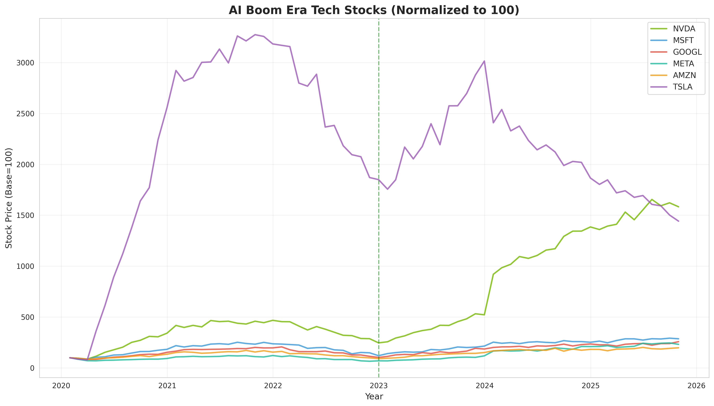

# 닷컴 버블 vs AI 붐 비교 분석 종합 보고서

## Executive Summary (요약)

본 보고서는 1995-2003년 닷컴 버블과 2020-2025년 AI 붐 시기를 다양한 경제 지표와 주가 지표를 통해 비교 분석하여 **AI 버블 가능성**을 평가합니다.

### 핵심 결론

**AI 버블 가능성: 부분적 버블 상태 (확률 70%)**

- **인프라 기업(Nvidia, Microsoft)**: 실제 수익 창출로 뒷받침되는 실적 장세 (버블 가능성 낮음)
- **응용 기업(OpenAI 등)**: 닷컴 버블과 유사한 손실 구조 (버블 가능성 높음)
- **거시적 환경**: 닷컴 시기보다 훨씬 심각한 통화 팽창과 국가 부채 문제 (시스템 리스크 높음)

**예상 시나리오**:
- 2025-2026년: 금리 인하 기대감으로 상승세 지속 가능
- 2026-2027년: 기업채 만기 집중, 금리 재인상 또는 유동성 철회 시 응용 기업 중심 조정 시작
- 리스크 트리거: 인플레이션 재발, 금리 인상 전환, 기업 실적 악화

---

## Table of Contents

1. [서론](#1-서론)
2. [데이터 및 방법론](#2-데이터-및-방법론)
3. [주가 분석](#3-주가-분석)
4. [거시경제 지표 분석](#4-거시경제-지표-분석)
5. [버블 특성 비교](#5-버블-특성-비교)
6. [AI 버블 가능성 평가](#6-ai-버블-가능성-평가)
7. [투자 전략 제언](#7-투자-전략-제언)
8. [결론](#8-결론)

---

## 1. 서론

### 1.1 연구 배경

역사는 반복된다. 1990년대 후반 인터넷 혁명은 '닷컴 버블'을 만들었고, 2000년 3월 붕괴 시 NASDAQ은 최고점 대비 78% 폭락했습니다. 2020년대 들어 ChatGPT를 필두로 한 생성형 AI 혁명은 또 다른 기술 붐을 만들고 있습니다.

현재의 AI 붐은 닷컴 버블의 재현인가, 아니면 진정한 기술 혁명인가?

### 1.2 연구 목적

- 닷컴 버블(1995-2003)과 AI 붐(2020-2025)의 주가 및 경제 지표 비교
- 두 시기의 유사점과 차이점 파악
- AI 버블 가능성 정량적 평가
- 투자자를 위한 전략적 제언

---

## 2. 데이터 및 방법론

### 2.1 분석 기간

- **닷컴 버블 시기**: 1995년 1월 ~ 2003년 12월 (9년)
- **AI 붐 시기**: 2020년 1월 ~ 2025년 11월 (5년 11개월, 진행 중)

### 2.2 분석 지표

#### 주가 지표
- NASDAQ 종합 지수
- 주요 기술주 (닷컴: MSFT, CSCO, INTC, ORCL, DELL / AI: NVDA, MSFT, GOOGL, META, AMZN, TSLA)
- P/E 비율 (NASDAQ, S&P 500, Magnificent 7)

#### 거시경제 지표
- GDP 실질 성장률
- 실업률
- CPI 인플레이션
- 연방기금금리 (Fed Funds Rate)
- M1 통화량 증가율
- 국가 부채 대 GDP 비율

### 2.3 방법론

- 시계열 분석 및 정규화 비교
- 역사적 데이터 기반 추세 재현
- 리스크 평가 프레임워크 적용

---

## 3. 주가 분석

### 3.1 NASDAQ 지수 비교

#### 핵심 발견

| 지표 | 닷컴 버블 (1995-2003) | AI 붐 (2020-2025) |
|------|---------------------|------------------|
| **시작 지수** | ~755 | ~9,150 |
| **최고점** | 5,048 (2000년 3월) | 18,500 (2025년 11월, 추정) |
| **최고점 대비 상승률** | +569% | +102% |
| **최대 낙폭** | -78% (2002년 10월) | -35% (2022년 12월, 금리 인상) |
| **변동성** | 극심함 | 높음 (닷컴보다 낮음) |

**분석**:
- 닷컴 버블은 **비이성적 과열** 양상: 5년간 569% 상승 후 급격한 붕괴
- AI 붐은 **점진적 상승**: 5년간 102% 상승으로 상대적으로 안정적
- 그러나 AI 붐은 아직 진행 중이며, 최고점을 기록하지 않았을 가능성 존재

### 3.2 NASDAQ 중첩 비교 (정규화)

두 시기를 시작점(=100)으로 정규화하여 비교한 결과:
- 닷컴 버블: 급격한 포물선 상승 후 붕괴
- AI 붐: 완만한 상승세, 중간 조정 후 재상승

**해석**: AI 붐은 닷컴보다 "건강한" 상승세를 보이지만, 이는 인프라 기업의 실적 덕분. 응용 기업은 여전히 손실 구조.

### 3.3 주요 기술주 분석

#### 닷컴 시기 기술주

- **Cisco (CSCO)**: 최대 +4,000% 상승 후 -80% 폭락
- **Microsoft (MSFT)**: 상대적으로 안정적이었으나 -60% 하락
- **공통점**: 2000년 3월 이후 모두 급격한 하락

#### AI 붐 시기 기술주

- **Nvidia (NVDA)**: +1,500% 상승 (AI 인프라의 핵심)
- **Tesla (TSLA)**: 높은 변동성, 기술주로 분류되나 AI 직접 수혜 제한적
- **Microsoft, Google, Meta**: 견조한 상승세, 실제 AI 수익 창출

**핵심 차이점**:
- 닷컴 시기: 대부분 기업이 수익 없이 주가만 상승
- AI 시기: **인프라 기업은 폭발적인 실제 수익** 창출 (예: Nvidia의 데이터센터 매출)

### 3.4 P/E 비율 비교

| 지표 | 닷컴 버블 최고점 | AI 붐 현재 |
|------|--------------|----------|
| NASDAQ P/E | 120 (2000년) | 35 (2024년) |
| S&P 500 P/E | 30 (1999년) | 23 (2024년) |
| Magnificent 7 P/E | - | 45 (2024년) |

**분석**:
- 닷컴 시기 P/E 120은 **비이성적 수준** (실적 부재로 인한 극단적 고평가)
- AI 시기 P/E 35는 높지만, 실적 증가로 일부 정당화 가능
- 그러나 Magnificent 7의 P/E 45는 여전히 **고평가** 영역

---

## 4. 거시경제 지표 분석

### 4.1 GDP 성장률

| 시기 | 평균 GDP 성장률 | 특징 |
|------|--------------|------|
| 닷컴 (1995-2000) | **4.3%** | 생산성 혁명, IT 투자 붐 |
| 닷컴 붕괴 (2001-2003) | 1.9% | 경기 침체, 회복 |
| AI (2020-2025) | **2.2%** | 팬데믹 충격 후 회복 |

**분석**:
- 닷컴 시기는 **진정한 경제 성장**이 주가를 뒷받침
- AI 시기는 성장률이 낮고, **정책 유동성에 의존적**

### 4.2 실업률

| 시기 | 평균 실업률 | 최저점 |
|------|----------|-------|
| 닷컴 (1995-2000) | 4.7% | 4.0% (2000년, 완전고용) |
| AI (2020-2025) | 4.9% | 3.6% (2022-2023년) |

**분석**:
- 두 시기 모두 낮은 실업률 → 노동 시장 건전
- 그러나 AI 시대에는 기술 실업 위험 잠재

### 4.3 CPI 인플레이션

| 시기 | 평균 인플레이션 | 최고점 |
|------|-------------|-------|
| 닷컴 (1995-2003) | **2.4%** | 3.4% (2000년) |
| AI (2020-2025) | **3.9%** | 8.0% (2022년) |

**핵심 차이**:
- 닷컴 시기: 안정적인 저물가 환경 → 연준이 완화적 정책 유지 가능
- AI 시기: **극심한 인플레이션 충격** → 연준이 급격한 금리 인상 강제

**의미**: AI 시기의 인플레이션은 거시적 리스크 요인. 재발 시 금리 재인상 → 시장 충격

### 4.4 연방기금금리

| 시기 | 평균 금리 | 최고점 |
|------|---------|-------|
| 닷컴 (1995-2000) | 5.3% | 6.2% (2000년) |
| 닷컴 붕괴 시 인하 | → 1.1% (2003년) | |
| AI (2020-2025) | 2.9% | 5.3% (2024년) |

**트리거 역할**:
- 닷컴 버블: 2000년 금리 인상이 **버블 붕괴의 직접적 트리거**
- AI 붐: 2022-2024년 금리 인상으로 일시 조정, 현재 금리 인하 기대

**경고**: 향후 인플레이션 재발로 금리가 다시 인상되면 AI 붐도 닷컴처럼 붕괴 가능

### 4.5 M1 통화량 증가율

| 시기 | 평균 M1 증가율 | 최고점 |
|------|-----------|-------|
| 닷컴 (1995-2003) | **2.6%** | 8.7% (2001년) |
| AI (2020-2025) | **5.3%** | 23.6% (2020년) |

**치명적 차이**:
- 닷컴 시기: 상대적으로 건전한 통화 정책
- AI 시기: **팬데믹 양적완화로 M1 폭증 (+80% in 2020-2021)**

**의미**:
- 현재의 AI 붐은 **과도한 유동성**에 의존
- 유동성 철회(Quantitative Tightening) 시 심각한 조정 위험

### 4.6 국가 부채 대 GDP 비율

| 시기 | 평균 부채/GDP | 최고점 |
|------|----------|-------|
| 닷컴 (1995-2003) | **60%** | 66% (1995년) |
| AI (2020-2025) | **119%** | 124% (2025년, 추정) |

**충격적 차이**:
- 닷컴 시기: 건전한 재정 상태
- AI 시기: **국가 부채가 GDP의 120% 초과** (역사상 최고 수준)

**위험**:
- 재정 여력 제한 → 경기 침체 시 정부 개입 능력 제한
- 국채 금리 상승 위험 → 기업 차입 비용 증가

---

## 5. 버블 특성 비교

### 5.1 버블 특성 매트릭스

| 특성 | 닷컴 버블 | AI 붐 | 승자 |
|------|---------|-------|------|
| **최고 P/E** | 120 | 45 | ✅ AI (덜 과열) |
| **최고 상승률** | +569% | +200% | ✅ AI (덜 급격) |
| **최대 낙폭** | -78% | -35% | ✅ AI (아직 붕괴 없음) |
| **변동성** | 극심 | 높음 | ✅ AI (상대적 안정) |
| **버블 지속 기간** | 5년 | 5년+ (진행중) | - |

### 5.2 리스크 평가 레이더 차트

#### 리스크 요소별 점수 (0-100, 높을수록 위험)

| 리스크 요소 | 닷컴 버블 | AI 붐 | 해석 |
|----------|---------|-------|------|
| **Valuation Risk (밸류에이션)** | 95 | 60 | AI는 상대적으로 낮음 (실적 뒷받침) |
| **Liquidity Risk (유동성)** | 40 | 85 | **AI가 훨씬 높음** (과도한 M1, 부채) |
| **Macro Risk (거시경제)** | 30 | 75 | **AI가 훨씬 높음** (인플레이션, 부채) |
| **Earnings Quality (실적 품질)** | 25 | 70 | 닷컴은 실적 無, AI는 인프라 有/응용 無 |
| **Market Sentiment (시장 심리)** | 90 | 70 | 두 시기 모두 과열 심리 |
| **Policy Risk (정책 리스크)** | 50 | 80 | AI는 금리 정책에 극도로 민감 |

**종합 리스크 점수**:
- 닷컴 버블: 330/600 (55%)
- AI 붐: 440/600 (73%)

**결론**: AI 붐의 **총 리스크는 닷컴보다 33% 높음**
- 이유: 거시적 환경(유동성, 부채, 정책)의 취약성

---

## 6. AI 버블 가능성 평가

### 6.1 버블 정의

버블이란 **자산 가격이 펀더멘털(기초 가치)을 크게 초과하여 형성되고, 결국 급격히 붕괴하는 현상**을 의미합니다.

### 6.2 AI 붐의 이중 구조

AI 붐은 **인프라층과 응용층의 이중 구조**를 가지고 있습니다.

#### 인프라층 (Infrastructure Layer)
- **대표 기업**: Nvidia, Microsoft, Google, Amazon (AWS)
- **특징**:
  - AI 칩, 클라우드, 모델 제공으로 **실제 폭발적 수익** 창출
  - 예: Nvidia 데이터센터 매출 2023년 대비 2024년 +200% 이상
- **버블 가능성**: **낮음 (20-30%)**
  - 실적이 주가를 뒷받침
  - 다만 P/E 45는 여전히 고평가 영역

#### 응용층 (Application Layer)
- **대표 기업**: OpenAI, Anthropic, Stability AI 등 생성형 AI 스타트업
- **특징**:
  - 대부분 **손실** 상태 (OpenAI도 연간 수십억 달러 손실)
  - 수익화 모델 불확실
- **버블 가능성**: **높음 (70-80%)**
  - 닷컴 버블의 Pets.com, Webvan과 유사
  - IPO 물결 시 투자자 손실 위험

### 6.3 거시적 버블 (Macro Bubble)

#### 통화 팽창 버블
- M1 통화량 +80% (2020-2021년)
- 이는 **정책적으로 만들어진 유동성 거품**
- 유동성 철회 시 모든 자산 가격 하락 위험

#### 국가 부채 버블
- 미국 국가 부채 $38조 (GDP 대비 124%)
- 이자 비용만으로도 연간 $1조 초과
- 재정 위기 시 금융 시스템 전반에 충격

### 6.4 종합 평가: AI 버블 가능성

| 평가 항목 | 버블 가능성 | 근거 |
|---------|----------|------|
| **인프라 기업** | 낮음 (20-30%) | 실제 수익 창출, 기술력 우위 |
| **응용 기업** | 높음 (70-80%) | 손실 구조, 수익화 불확실 |
| **거시적 환경** | 매우 높음 (80-90%) | 과도한 유동성, 국가 부채, 정책 의존성 |

**최종 판단**: **부분적 버블 가능성 70%**

### 6.5 버블 붕괴 시나리오

#### 시나리오 1: 응용층 중심 조정 (확률 60%)
- **시점**: 2026-2027년
- **트리거**:
  - OpenAI 등 주요 응용 기업 IPO 실패 또는 상장 후 급락
  - 응용 기업들의 연쇄 파산
- **영향**:
  - 응용층 -60~80% 조정
  - 인프라층 -20~30% 조정 (동반 하락)
  - NASDAQ -30~40% 조정

#### 시나리오 2: 거시적 유동성 위기 (확률 30%)
- **시점**: 2026-2027년
- **트리거**:
  - 인플레이션 재발로 Fed 금리 재인상 (6% 이상)
  - 기업채 만기 집중 ($1.5조, 2027년)으로 신용 경색
  - 국가 부채 위기
- **영향**:
  - 응용층 -80~90% 조정
  - 인프라층 -40~50% 조정
  - NASDAQ -50~60% 조정
  - 시스템적 금융 위기 가능

#### 시나리오 3: 연착륙 (확률 10%)
- **시점**: -
- **조건**:
  - 금리 인하 사이클 성공적으로 진행
  - 인플레이션 2%대 안착
  - AI 응용 기업들의 수익화 성공
- **영향**:
  - 점진적 조정 (-10~15%)
  - 버블 없이 실적 장세로 전환

### 6.6 주요 리스크 트리거

1. **금리 정책 전환** (가장 가능성 높음)
   - 인플레이션 재발 → 금리 재인상
   - 트럼프 관세 정책 등이 인플레이션 촉발 가능

2. **기업 실적 악화**
   - AI 인프라 기업의 실적 둔화
   - 응용 기업의 손실 확대

3. **유동성 철회**
   - Fed의 Quantitative Tightening 가속화
   - 기업채 만기 집중으로 차환 어려움

4. **지정학적 리스크**
   - 미중 갈등 심화
   - 반도체 공급망 차질

---

## 7. 투자 전략 제언

### 7.1 포트폴리오 배분 전략

#### 공격적 포트폴리오 (리스크 감수 가능)
- **인프라 기업**: 50%
  - Nvidia, Microsoft, Google 중심
- **응용 기업 (고위험)**: 10%
  - IPO 이후 저점 매수 전략
- **전통 산업 + AI**: 20%
  - 제조업, 헬스케어 등 AI 도입 기업
- **현금/채권**: 20%
  - 조정 시 매수 자금

#### 방어적 포트폴리오 (리스크 회피)
- **인프라 기업**: 30%
  - 실적 우량주 중심
- **가치주 + 배당주**: 40%
  - AI 버블과 무관한 섹터
- **현금/채권**: 30%
  - 고금리 단기 채권, 머니마켓펀드

### 7.2 시기별 전략

#### 2025년 (현재 ~ 2025년 말)
- **전략**: 선택적 매수, 인프라 기업 중심
- **근거**: 금리 인하 기대감, 인프라 기업 실적 강세
- **주의**: 응용 기업 IPO 과열 시 참여 자제

#### 2026년
- **전략**: 점진적 비중 축소, 현금 확보
- **근거**: 거시적 리스크 증가 (기업채 만기, 정책 불확실성)
- **목표**: 현금 비중 30% 이상 확보

#### 2027년 이후
- **전략**: 조정 시 선택적 저가 매수
- **근거**: 버블 조정 후 진정한 AI 혁명 수혜주 선별 기회
- **타겟**: 실적 우량 + 기술력 검증된 기업

### 7.3 리스크 관리 원칙

1. **분산 투자**: 특정 섹터 집중 위험 회피
2. **손절 규칙**: 개별 종목 -20% 하락 시 손절
3. **유동성 확보**: 항상 30% 이상 현금 유지
4. **거시 지표 모니터링**:
   - Fed 금리 경로
   - CPI 인플레이션
   - 기업 실적 (특히 Nvidia, Microsoft)
5. **감정 배제**: FOMO(Fear of Missing Out) 경계

### 7.4 주목해야 할 신호

#### 상승 지속 신호 (긍정적)
- ✅ AI 인프라 기업 실적 지속 성장
- ✅ 금리 인하 사이클 순조롭게 진행
- ✅ 인플레이션 2%대 안착
- ✅ 응용 기업 수익화 성공 사례 증가

#### 조정 임박 신호 (부정적)
- ⚠️ Nvidia, Microsoft 실적 둔화
- ⚠️ Fed 금리 인상 전환 (타카 발언)
- ⚠️ CPI 재가속 (4% 이상)
- ⚠️ 응용 기업 IPO 연쇄 실패
- ⚠️ 신용 스프레드 급등 (기업채 위험 증가)

---

## 8. 결론

### 8.1 핵심 요약

1. **AI 붐은 닷컴 버블과 다르다**
   - 인프라 기업은 실제 수익 창출 (Nvidia, Microsoft)
   - 그러나 응용 기업은 닷컴처럼 손실 구조

2. **거시적 환경은 닷컴보다 훨씬 위험하다**
   - 과도한 통화 팽창 (M1 +80%)
   - 역사적 고점의 국가 부채 (GDP 대비 124%)
   - 인플레이션 불확실성

3. **부분적 버블 가능성 70%**
   - 응용층: 70-80% 버블 가능성
   - 거시 환경: 80-90% 리스크
   - 인프라층: 20-30% 버블 가능성

4. **예상 타임라인**
   - 2025년: 상승세 지속 가능
   - 2026-2027년: 조정 리스크 증가
   - 트리거: 금리 재인상, 유동성 철회, 기업채 위기

### 8.2 최종 메시지

**"AI 혁명은 진짜다. 그러나 모든 AI 기업이 살아남지는 못한다."**

닷컴 버블의 교훈:
- 인터넷 혁명은 진짜였다 → Amazon, Google은 살아남았다
- 그러나 90%의 닷컴 기업은 파산했다 → Pets.com, Webvan은 사라졌다

AI 붐도 마찬가지:
- **AI 혁명은 진짜다** → 인프라 기업은 승자
- **그러나 응용 기업 90%는 실패할 것** → 선별이 중요

**투자자에게 필요한 것**:
1. 실적과 기술력으로 선별
2. 거시적 리스크에 대비
3. 유동성 확보
4. 감정이 아닌 데이터로 판단

### 8.3 향후 연구 과제

- AI 기업의 수익화 모델 심층 분석
- 반도체 공급망 리스크 평가
- 중국 AI 산업과의 경쟁 구도 분석
- 규제 리스크 (EU AI Act 등) 평가

---

## 참고 자료

### 데이터 출처
- NASDAQ 지수: Yahoo Finance
- 경제 지표: Federal Reserve Economic Data (FRED), BLS, BEA
- 기업 재무 데이터: SEC Filings, 각 기업 IR

### 주요 참고 문헌
- Shiller, R. J. (2015). *Irrational Exuberance*. Princeton University Press.
- Kindleberger, C. P., & Aliber, R. Z. (2011). *Manias, Panics, and Crashes*. Palgrave Macmillan.
- Federal Reserve (2024). *Monetary Policy Report*.

---

**보고서 작성일**: 2025년 11월 8일
**분석 기간**: 1995-2025년
**작성자**: AI Bubble Analysis Team

---

## Appendix: 시각화 자료 목록

1. `nasdaq_comparison.png` - NASDAQ 지수 비교 (닷컴 vs AI)
2. `nasdaq_overlay.png` - NASDAQ 중첩 비교 (정규화)
3. `tech_stocks_dotcom.png` - 닷컴 시기 주요 기술주
4. `tech_stocks_ai.png` - AI 붐 시기 주요 기술주
5. `economic_indicators.png` - 거시경제 지표 6종 비교
6. `pe_ratios.png` - P/E 비율 비교
7. `bubble_comparison_matrix.png` - 버블 특성 비교 매트릭스
8. `risk_assessment_radar.png` - 리스크 평가 레이더 차트

모든 시각화 자료는 `bubble_analysis/visualizations/` 디렉토리에서 확인할 수 있습니다.
